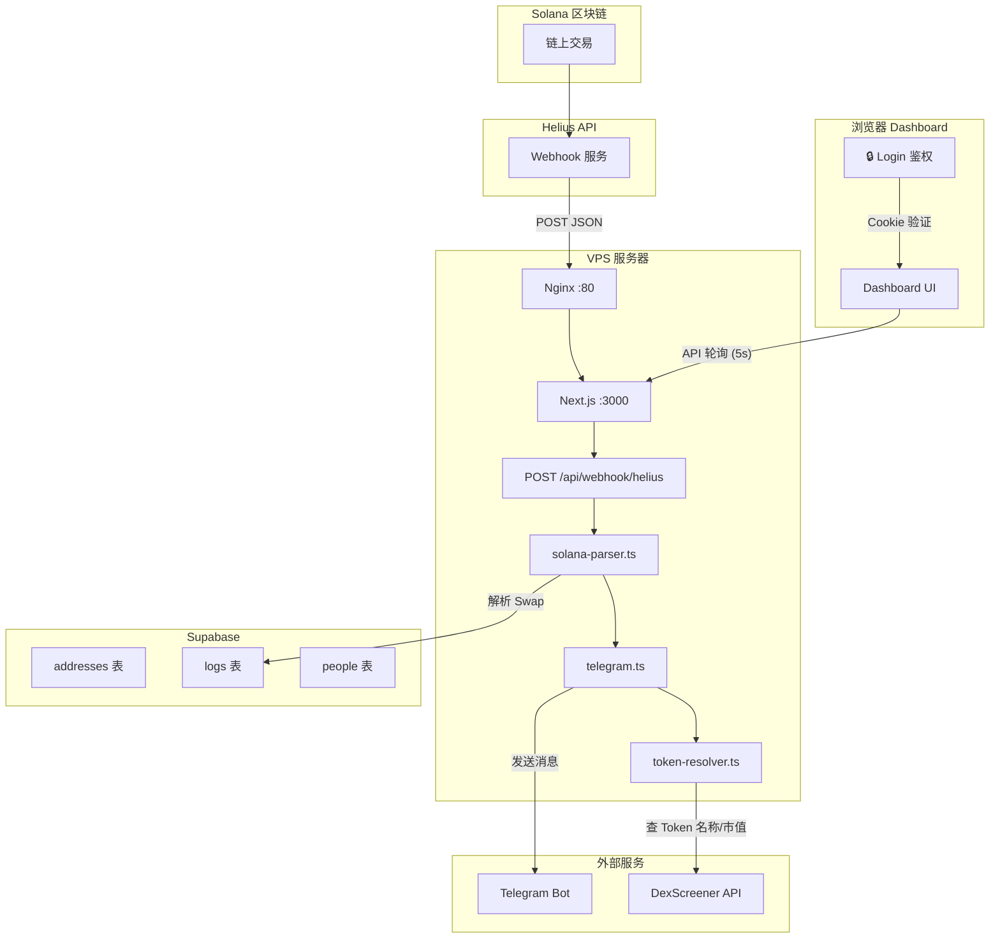
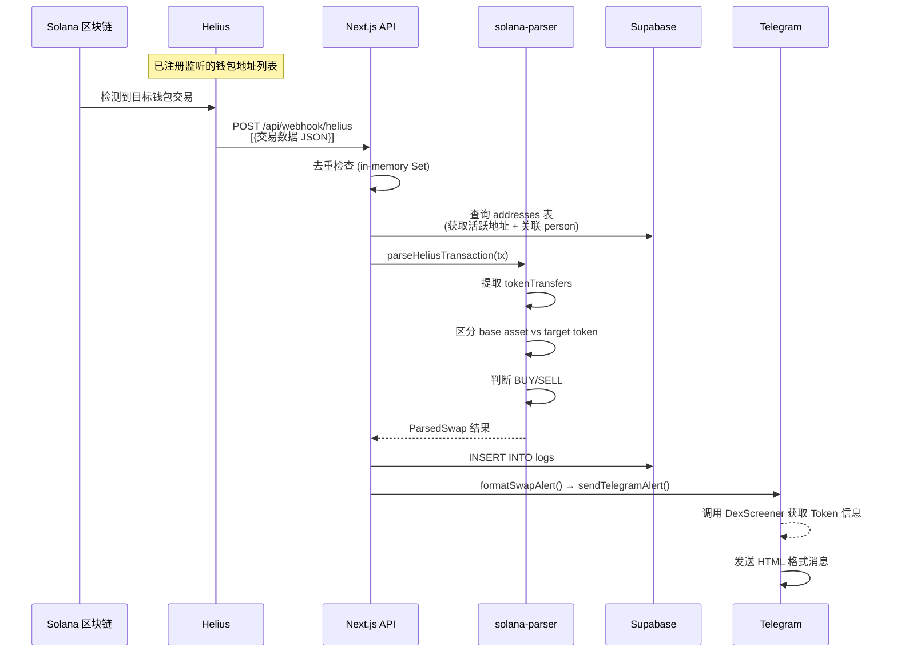
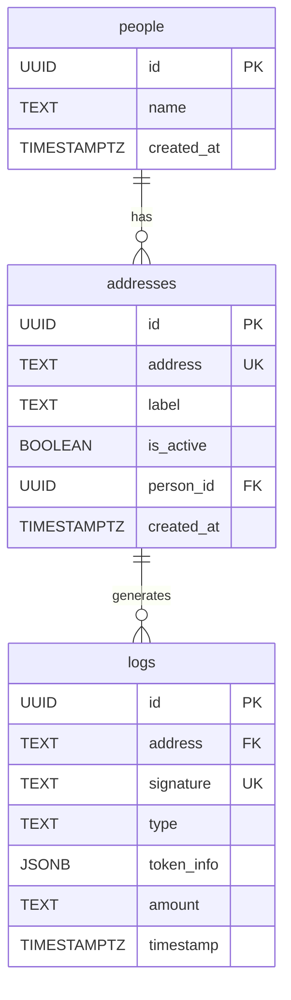

# Sol-Tracker 技术文档

## 1. 项目概述

Sol-Tracker (Sol Sniper) 是一个 **Solana 链上钱包监控工具**，核心功能是：
- 跟踪指定钱包地址的链上 Swap 交易（买入/卖出）
- 通过 Telegram Bot 实时推送交易通知
- Web Dashboard 实时展示交易记录和监控状态

**技术栈**：Next.js 16 + Supabase + Helius + Telegram Bot API + TailwindCSS

---

## 2. 项目结构

```
sol-tracker/
├── src/
│   ├── app/
│   │   ├── api/
│   │   │   ├── addresses/route.ts    # 地址 CRUD API
│   │   │   ├── auth/login/route.ts   # 🔒 登录 API
│   │   │   ├── auth/logout/route.ts  # 🔒 登出 API
│   │   │   ├── logs/route.ts         # 交易日志 API
│   │   │   ├── people/route.ts       # 人员 CRUD API
│   │   │   ├── stats/route.ts        # 统计数据 API
│   │   │   └── webhook/helius/route.ts  # ⭐ Helius Webhook 接收端
│   │   ├── login/page.tsx            # 🔒 登录页面
│   │   ├── page.tsx                  # 首页入口
│   │   ├── layout.tsx                # 全局布局
│   │   └── globals.css
│   ├── components/
│   │   ├── dashboard/
│   │   │   ├── dashboard-shell.tsx    # 主布局（左侧栏 + 内容区 + 退出按钮）
│   │   │   ├── address-sidebar.tsx    # 左侧地址管理面板
│   │   │   ├── dashboard-stats.tsx    # 统计卡片（API 轮询）
│   │   │   └── recent-activity.tsx    # 交易记录表格（API 轮询）
│   │   └── ui/                       # shadcn/ui 基础组件
│   ├── lib/
│   │   ├── auth.ts                   # 🔒 Token 签发/验证
│   │   ├── supabase.ts               # Supabase 客户端（仅服务端）
│   │   ├── helius-sync.ts            # Helius Webhook 同步逻辑
│   │   ├── solana-parser.ts          # ⭐ 交易解析核心
│   │   ├── telegram.ts              # Telegram 推送 + 消息格式化
│   │   ├── token-resolver.ts         # Token 信息解析（名称/市值）
│   │   ├── logger.ts                 # 文件日志
│   │   └── utils.ts                  # 工具函数
│   └── middleware.ts                 # 🔒 路由鉴权拦截
├── scripts/
│   ├── manage-webhook.js             # 手动管理 Helius Webhook
│   ├── sync-helius.js                # 手动同步地址到 Helius
│   └── check-helius.js               # Helius 状态检查
├── supabase/
│   ├── schema.sql                    # 完整数据库 Schema
│   └── migration-people.sql          # People 表迁移脚本
├── deploy/                           # VPS 部署配置
│   ├── nginx.conf
│   ├── setup-server.sh
│   └── deploy.sh
└── ecosystem.config.js               # PM2 配置
```

---

## 3. 核心工作流程

### 3.1 整体架构



### 3.2 Helius Webhook 工作原理



**关键流程说明：**

1. **Helius 如何知道监听谁？** — 通过 Helius REST API 注册 webhook，提供 `accountAddresses`（钱包列表）和 `webhookURL`（回调地址）。每次在 Dashboard 中增删地址时，[helius-sync.ts](file:///Users/sixseven/dev/ai-coding/sol-tracker/src/lib/helius-sync.ts) 会自动调 Helius API 更新地址列表。

2. **交易如何推送过来？** — Helius 检测到目标地址的交易后，将 Enhanced Transaction 数据以 JSON 数组 POST 到 `webhookURL`。

3. **如何判断买卖？** — [solana-parser.ts](file:///Users/sixseven/dev/ai-coding/sol-tracker/src/lib/solana-parser.ts) 的核心逻辑：
   - 将 `tokenTransfers` 分为 **base asset**（SOL/USDC/USDT）和 **target token**
   - 如果钱包 **收到** target token → `BUY`
   - 如果钱包 **发出** target token → `SELL`

### 3.3 Telegram 推送原理

[telegram.ts](file:///Users/sixseven/dev/ai-coding/sol-tracker/src/lib/telegram.ts) 的工作：

1. 收到 `ParsedSwap` 数据后，调用 [token-resolver.ts](file:///Users/sixseven/dev/ai-coding/sol-tracker/src/lib/token-resolver.ts) 获取 Token 名称和市值
2. **Token 信息解析优先级**：内存缓存 → DexScreener API → 硬编码已知 Token → Jupiter API → 地址缩写 fallback
3. 格式化为 HTML 消息（包含 BUY/SELL 图标、Token 名称、金额、市值、Solscan/Birdeye/DexScreener 链接）
4. 通过 Telegram Bot API `sendMessage` 发送到指定 `CHAT_ID`

### 3.4 Dashboard 数据更新

前端组件通过**服务端 API 路由 + 5 秒轮询**获取数据（Supabase 仅在服务端使用，密钥不暴露）：

- [dashboard-stats.tsx](file:///Users/sixseven/dev/ai-coding/sol-tracker/src/components/dashboard/dashboard-stats.tsx) — 每 5 秒调用 `GET /api/stats`
- [recent-activity.tsx](file:///Users/sixseven/dev/ai-coding/sol-tracker/src/components/dashboard/recent-activity.tsx) — 每 5 秒调用 `GET /api/logs`

### 3.5 登录认证

- **Middleware** 拦截所有请求，未登录 → 重定向 `/login`
- **白名单**：`/login`、`/api/auth/*`、`/api/webhook/*` 不需要登录
- **Cookie**：HMAC-SHA256 签名，HttpOnly，7 天有效期

---

## 4. 数据库 Schema



**`token_info` JSONB 结构示例**：
```json
{
  "mint": "7vfCXTUXx5WJV5JADk17DUJ4ksgau7utNKj4b963voxs",
  "amount": 1234567,
  "action": "BUY",
  "costMint": "So11111111111111111111111111111111111111112",
  "costAmount": 2.5,
  "costSymbol": "SOL",
  "personName": "Trader A"
}
```

---

## 5. 可优化的地方

### 🔴 高优先级

| 问题 | 现状 | 建议 |
|---|---|---|
| ~~**无鉴权**~~ | ✅ 已解决 | Middleware + Cookie 鉴权，密码登录 |
| ~~**Anon Key 暴露**~~ | ✅ 已解决 | 去掉 `NEXT_PUBLIC_` 前缀，前端通过 API 路由获取数据 |
| ~~**Token 缓存无 TTL**~~ | ✅ 已解决 | 采用静动分离缓存：Symbol永久缓存，市值(MarketCap) 60秒 TTL + 防雪崩并发去重 |
| **日志写文件** | `logger.ts` 用 `appendFileSync` 同步写文件 | standalone 模式下 `process.cwd()` 可能不对；应改用 PM2 日志 或结构化日志 |

### 🟡 中优先级

| 问题 | 现状 | 建议 |
|---|---|---|
| **In-memory 去重** | `processedSignatures` 在 serverless 重启后丢失 | VPS 部署下这个问题不大，但数据库侧已有 `UNIQUE(signature)` 兜底 |
| **People API 效率** | GET People 做两次查询再 JS 端 merge | 改用 Supabase 的 `.select('*, addresses(*)')` 嵌套查询 |
| **错误处理** | Webhook 路由 catch 后返回 500，Helius 会重试导致重复 | 对可恢复错误返回 200，避免 Helius 暴风重试 |
| **WEBHOOK_URL 硬编码** | `helius-sync.ts` 读 `process.env.WEBHOOK_URL` | standalone 模式下需确保环境变量正确注入 |

### 🟢 低优先级

| 问题 | 建议 |
|---|---|
| `formatAmount` 在 `recent-activity.tsx` 和 `token-resolver.ts` 中重复实现 | 统一到 `token-resolver.ts` |
| 没有 loading/error 状态的统一处理 | 添加全局 Error Boundary 和 Toast 通知 |
| 无 TypeScript 类型定义数据库表 | 使用 `supabase gen types` 生成类型 |

---

## 6. 下一步可实现的需求

### 🚀 功能增强

| 需求 | 说明 | 难度 |
|---|---|---|
| **跟单功能** | 检测到目标钱包 BUY 时，自动用自己钱包跟单买入 | ⭐⭐⭐⭐ |
| **盈亏分析** | 记录每笔 BUY 的成本，SELL 时计算盈亏比 | ⭐⭐⭐ |
| **Token 持仓面板** | 展示每个监控钱包当前持有的 Token 列表和价值 | ⭐⭐⭐ |
| **历史交易图表** | 用图表展示交易频率、资金流向趋势 | ⭐⭐ |
| **多 Chat 推送** | 支持将不同 Person 的交易推送到不同 Telegram 群 | ⭐⭐ |
| **过滤规则** | 支持按金额/Token/DEX 过滤，只推送符合条件的交易 | ⭐⭐ |
| **Webhook 签名验证** | 验证请求确实来自 Helius，防伪造 | ⭐ |

### 🛡️ 工程改进

| 需求 | 说明 | 难度 |
|---|---|---|
| ~~**用户认证**~~ | ✅ 已实现：密码登录 + Middleware 鉴权 | — |
| **HTTPS** | 绑定域名 + Let's Encrypt 免费证书 | ⭐ |
| ~~**CI/CD**~~ | ✅ 已实现：GitHub Actions push → main 自动部署 | — |
| **监控告警** | PM2 + UptimeRobot 监控应用存活，宕机时通知 | ⭐ |
| **日志系统** | 用 Supabase 存日志代替文件日志，可在 Dashboard 中查看 | ⭐⭐ |
| **数据库备份** | 定期备份 Supabase 数据 | ⭐ |
