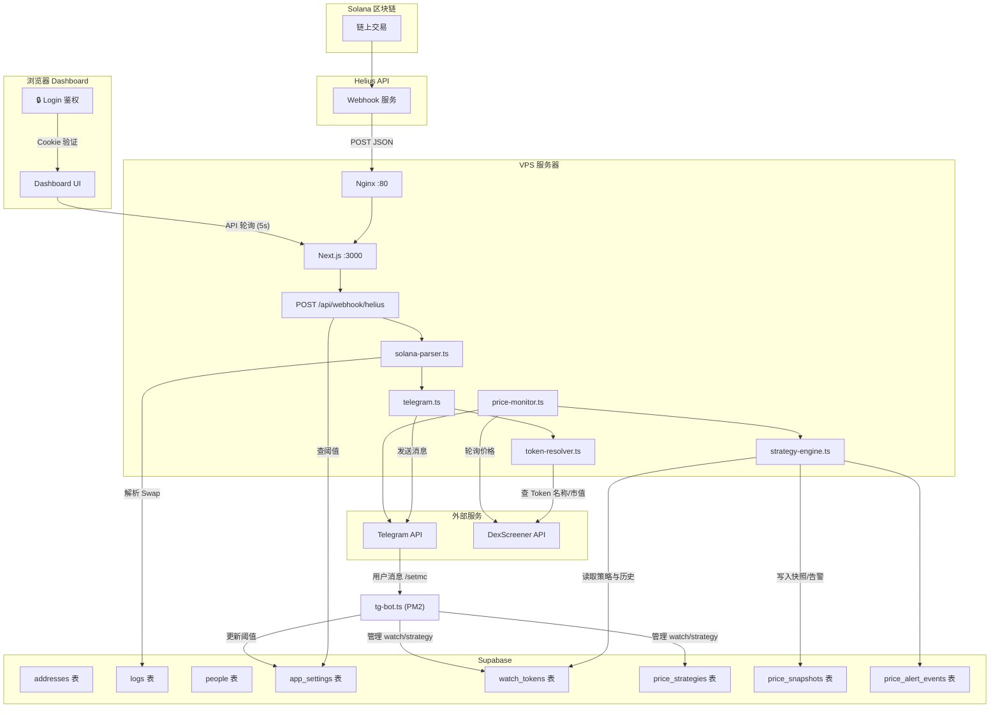
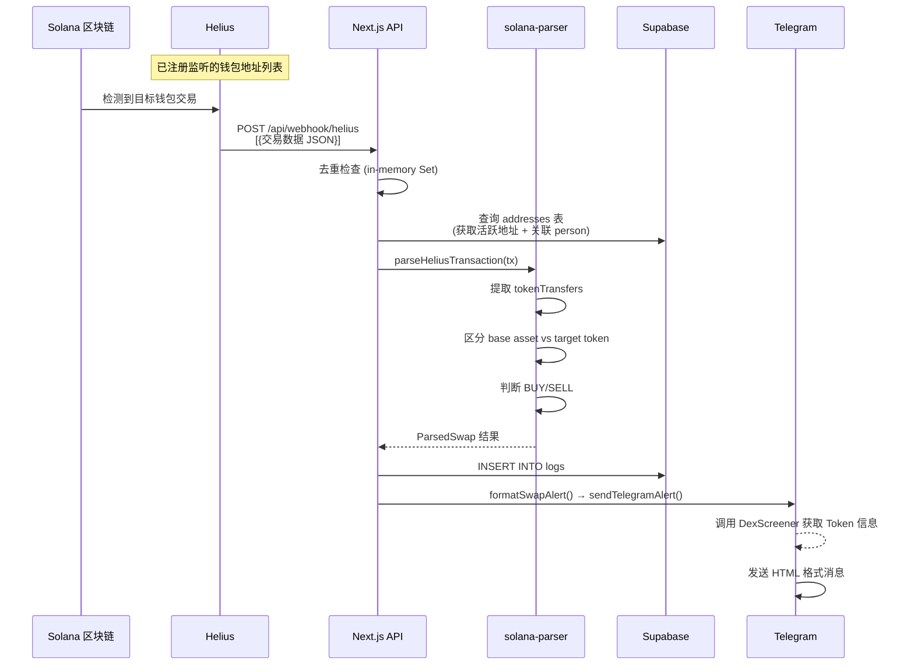
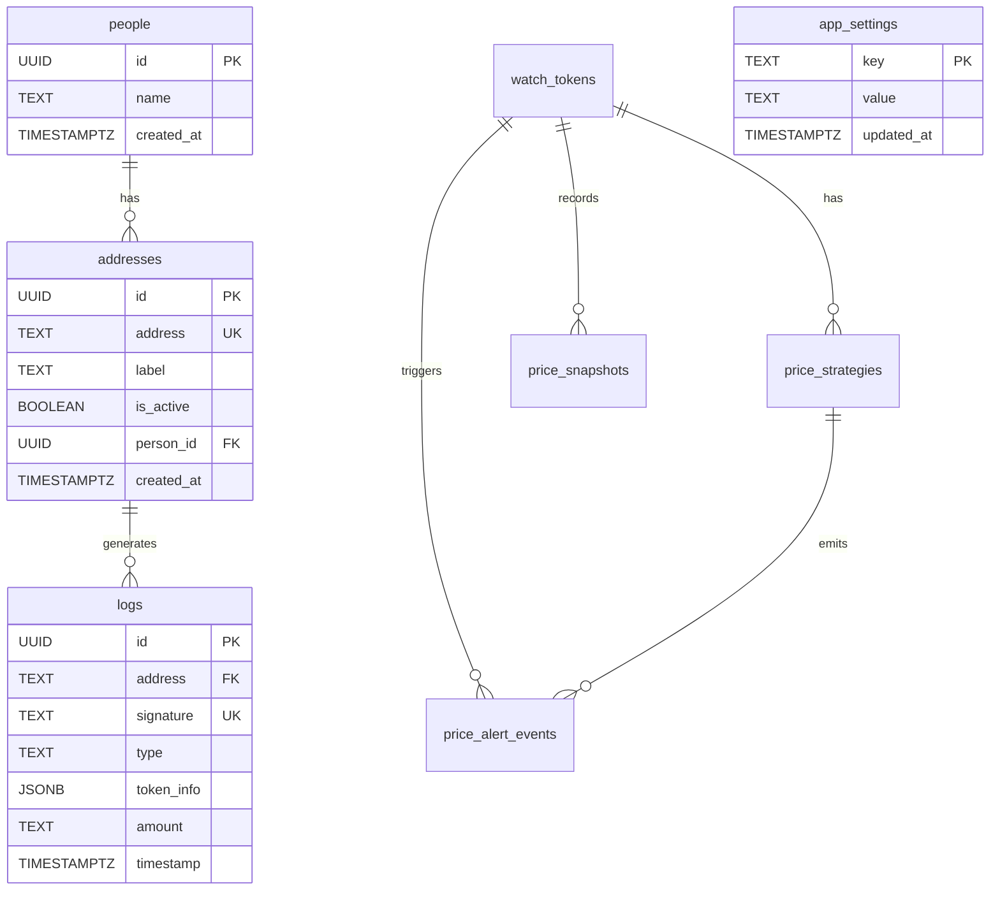

# Sol-Tracker 技术文档

## 1. 项目概述

Sol-Tracker (Sol Sniper) 是一个 **Solana 链上钱包监控工具**，核心功能是：
- 跟踪指定钱包地址的链上 Swap 交易（买入/卖出）
- 通过 Telegram Bot 实时推送交易通知
- Web Dashboard 实时展示交易记录和监控状态
- 通过价格行为策略监控指定代币，并在命中时推送 Telegram 提醒

**技术栈**：Next.js 16 + Supabase + Helius + Telegram Bot API + TailwindCSS

> 这份文档聚焦系统全貌和运维视角。实现细节优先看对应源码文件，避免文档与代码重复膨胀。

---

## 2. 项目结构

``` 
sol-tracker/
├── backtest-optimize.ts             # 本地命令行历史优化 / smoke test 脚本
├── src/
│   ├── app/
│   │   ├── api/
│   │   │   ├── addresses/route.ts    # 地址 CRUD API
│   │   │   ├── auth/login/route.ts   # 🔒 登录 API
│   │   │   ├── auth/logout/route.ts  # 🔒 登出 API
│   │   │   ├── logs/route.ts         # 交易日志 API
│   │   │   ├── price-alerts/route.ts # 价格告警历史 API
│   │   │   ├── price-backtest/route.ts # 信号回测 API
│   │   │   ├── strategy-optimize/route.ts # 策略优化推荐 API
│   │   │   ├── price-strategies/route.ts # 价格策略 CRUD API
│   │   │   ├── people/route.ts       # 人员 CRUD API
│   │   │   ├── stats/route.ts        # 统计数据 API
│   │   │   ├── watch-tokens/route.ts # 监控代币 CRUD API
│   │   │   └── webhook/helius/route.ts  # ⭐ Helius Webhook 接收端
│   │   ├── login/page.tsx            # 🔒 登录页面
│   │   ├── page.tsx                  # 首页入口
│   │   ├── layout.tsx                # 全局布局
│   │   └── globals.css
│   ├── components/
│   │   ├── dashboard/
│   │   │   ├── dashboard-shell.tsx    # 主布局（左侧栏 + 内容区 + 退出按钮）
│   │   │   ├── address-sidebar.tsx    # 左侧地址管理面板
│   │   │   ├── dashboard-stats.tsx    # 统计卡片（API 轮询）
│   │   │   ├── price-strategy-manager.tsx # 价格策略与监控代币管理面板
│   │   │   ├── strategy-optimizer-panel.tsx # 历史回测优化推荐面板
│   │   │   ├── strategy-backtest-panel.tsx # 信号回测面板
│   │   │   ├── price-alert-history.tsx    # 价格告警历史面板
│   │   │   └── recent-activity.tsx    # 交易记录表格（API 轮询）
│   │   └── ui/                       # shadcn/ui 基础组件
│   ├── lib/
│   │   ├── auth.ts                   # 🔒 Token 签发/验证
│   │   ├── supabase.ts               # Supabase 客户端（仅服务端）
│   │   ├── backtest-engine.ts        # 信号历史回测核心
│   │   ├── historical-price-provider.ts # 外部历史价格 provider + 缓存
│   │   ├── helius-sync.ts            # Helius Webhook 同步逻辑
│   │   ├── solana-parser.ts          # ⭐ 交易解析核心
│   │   ├── strategy-engine.ts        # 价格行为策略判定核心
│   │   ├── strategy-optimizer.ts     # 参数搜索、分段验证与推荐评分
│   │   ├── telegram.ts              # Telegram 推送 + 消息格式化
│   │   ├── token-resolver.ts         # Token 信息解析（名称/市值）
│   │   ├── logger.ts                 # 文件日志
│   │   └── utils.ts                  # 工具函数
│   └── middleware.ts                 # 🔒 路由鉴权拦截
├── scripts/
│   ├── manage-webhook.js             # 手动管理 Helius Webhook
│   ├── sync-helius.js                # 手动同步地址到 Helius
│   ├── check-helius.js               # Helius 状态检查
│   ├── price-monitor.ts              # 价格监控轮询进程
│   └── tg-bot.ts                     # ⭐ 独立运行的 Telegram Bot
├── supabase/
│   ├── schema.sql                    # 完整数据库 Schema
│   ├── migration-price-monitor.sql   # 价格监控相关迁移
│   ├── migration-people.sql          # People 表迁移脚本
│   └── migration-settings.sql        # app_settings 表迁移脚本
├── deploy/                           # VPS 部署配置
│   ├── nginx.conf
│   ├── setup-server.sh
│   └── deploy.sh
└── ecosystem.config.js               # PM2 配置 (包含 Next.js 和 Bot 进程)
```

---

## 3. 核心工作流程

### 3.1 整体架构


```mermaid
graph TB
    subgraph Solana["Solana 区块链"]
        TX["链上交易"]
    end

    subgraph Helius["Helius API"]
        WH["Webhook 服务"]
    end

    subgraph VPS["VPS 服务器"]
        NGINX["Nginx :80"]
        NEXT["Next.js :3000"]
        API_WH["POST /api/webhook/helius"]
        PARSER["solana-parser.ts"]
        MONITOR["price-monitor.ts"]
        ENGINE["strategy-engine.ts"]
        TG_LIB["telegram.ts"]
        RESOLVER["token-resolver.ts"]
    end

    subgraph Supabase["Supabase"]
        DB_ADDR["addresses 表"]
        DB_LOGS["logs 表"]
        DB_PPL["people 表"]
        DB_SET["app_settings 表"]
        DB_WATCH["watch_tokens 表"]
        DB_STRAT["price_strategies 表"]
        DB_SNAP["price_snapshots 表"]
        DB_ALERT["price_alert_events 表"]
    end

    subgraph External["外部服务"]
        TG["Telegram API"]
        DEX["DexScreener API"]
    end

    subgraph Client["浏览器 Dashboard"]
        AUTH["🔒 Login 鉴权"]
        DASH["Dashboard UI"]
    end

    TX --> WH
    WH -->|"POST JSON"| NGINX
    NGINX --> NEXT
    NEXT --> API_WH
    API_WH -->|"查阈值"| DB_SET
    API_WH --> PARSER
    PARSER -->|"解析 Swap"| DB_LOGS
    PARSER --> TG_LIB
    TG_LIB --> RESOLVER
    RESOLVER -->|"查 Token 名称/市值"| DEX
    TG_LIB -->|"发送消息"| TG
    AUTH -->|"Cookie 验证"| DASH
    DASH -->|"API 轮询 (5s)"| NEXT

    MONITOR -->|"轮询价格"| DEX
    MONITOR --> ENGINE
    ENGINE -->|"读取策略与历史"| DB_WATCH
    ENGINE -->|"写入快照/告警"| DB_SNAP
    ENGINE --> DB_ALERT
    MONITOR --> TG
    
    %% 独立 Bot 进程
    TG_BOT["tg-bot.ts (PM2)"]
    TG -->|"用户消息 /setmc"| TG_BOT
    TG_BOT -->|"更新阈值"| DB_SET
    TG_BOT -->|"管理 watch/strategy"| DB_WATCH
    TG_BOT -->|"管理 watch/strategy"| DB_STRAT
```

### 3.2 Helius Webhook 工作原理


```mermaid
sequenceDiagram
    participant S as Solana 区块链
    participant H as Helius
    participant N as Next.js API
    participant P as solana-parser
    participant DB as Supabase
    participant T as Telegram

    Note over H: 已注册监听的钱包地址列表
    S->>H: 检测到目标钱包交易
    H->>N: POST /api/webhook/helius<br/>[{交易数据 JSON}]
    N->>N: 去重检查 (in-memory Set)
    N->>DB: 查询 addresses 表<br/>(获取活跃地址 + 关联 person)
    N->>P: parseHeliusTransaction(tx)
    P->>P: 提取 tokenTransfers
    P->>P: 区分 base asset vs target token
    P->>P: 判断 BUY/SELL
    P-->>N: ParsedSwap 结果
    N->>DB: INSERT INTO logs
    N->>T: formatSwapAlert() → sendTelegramAlert()
    T-->>T: 调用 DexScreener 获取 Token 信息
    T->>T: 发送 HTML 格式消息
```

**关键流程说明：**

1. **Helius 如何知道监听谁？** — 通过 Helius REST API 注册 webhook，提供 `accountAddresses`（钱包列表）和 `webhookURL`（回调地址）。每次在 Dashboard 中增删地址时，[helius-sync.ts](../src/lib/helius-sync.ts) 会自动调 Helius API 更新地址列表。

2. **交易如何推送过来？** — Helius 检测到目标地址的交易后，将 Enhanced Transaction 数据以 JSON 数组 POST 到 `webhookURL`。

3. **如何判断买卖？** — [solana-parser.ts](../src/lib/solana-parser.ts) 的核心逻辑：
   - 将 `tokenTransfers` 分为 **base asset**（SOL/USDC/USDT）和 **target token**
   - 如果钱包 **收到** target token → `BUY`
   - 如果钱包 **发出** target token → `SELL`

### 3.3 Telegram 推送原理与交互 Bot

本项目包含两个与 Telegram 交互的部分：

1. **推送服务 (Webhook -> Telegram)**
   `telegram.ts` 被 Webhook 路由调用执行：
   - 收到 `ParsedSwap` 数据后，调用 `token-resolver.ts` 获取 Token 名称和市值
   - 从 `app_settings` 读取 `min_mc_threshold` 进行市值过滤，未达标跳过发送
   - 格式化为 HTML 消息发送到指定 `CHAT_ID`

2. **交互式 Bot (`scripts/tg-bot.ts`)**
   - 作为一个脱离 Next.js 的独立长轮询进程运行（通过 PM2 的 `sol-tracker-bot` 托管）
   - 基于 `telegraf` 开发，监听用户的 `/setmc <金额>` 等交互命令
   - 直接连接 Supabase 数据库将用户设置持久化写入 `app_settings` 表

### 3.4 价格行为监控与策略推送

价格行为监控是和钱包交易并行的第二条链路，整体流程是“轮询价格 -> 读策略 -> 触发告警 -> 发 Telegram -> 落库”。

1. **轮询进程 (`scripts/price-monitor.ts`)**
   - 作为 PM2 的 `sol-tracker-monitor` 进程运行
   - 按固定间隔从 DexScreener 拉取 watch token 的当前价格
   - 将价格写入 `price_snapshots`
   - 读取启用中的 `price_strategies` 并交给策略引擎评估

2. **策略引擎 (`src/lib/strategy-engine.ts`)**
   - `pct_change_up` / `pct_change_down`：按时间窗口计算涨跌幅
   - `breakout_up` / `breakout_down`：判断是否上破/下破阈值
   - 命中后先做 `cooldown` 去重，再写入 `price_alert_events`

3. **历史优化**
   - `strategy-optimizer-panel.tsx` 手动发起外部历史研究
   - `historical-price-provider.ts` 从 GeckoTerminal 拉取主 pool 的 OHLCV，并写入 `.cache/historical-price`
   - `strategy-optimizer.ts` 对 `entry_long` / `entry_rebound` / `pullback_to_ma` 做参数搜索
   - 搜索空间按 K 线根数定义，再换算成分钟窗口，避免 `15m/1h` 粒度下窗口过短导致零信号
   - `POST /api/strategy-optimize` 同时返回每种策略类型的最优参数和综合榜单，前端可单独应用或批量应用到 `price_strategies`

4. **告警展示**
   - 告警命中后通过 `telegram.ts` 发送消息
   - `Price Strategy Center` 负责管理 watch token 和策略，当前 UI 已拆成 watchlist / strategy composer / strategy registry 三个工作区，降低信息拥挤
   - `Price Alert History` 负责展示触发记录

### 3.5 Dashboard 数据更新

前端通过服务端 API 路由轮询获取数据。不同模块的刷新频率不同：

- [dashboard-stats.tsx](../src/components/dashboard/dashboard-stats.tsx) — 5 秒
- [recent-activity.tsx](../src/components/dashboard/recent-activity.tsx) — 5 秒
- [price-strategy-manager.tsx](../src/components/dashboard/price-strategy-manager.tsx) — 8 秒
- [strategy-optimizer-panel.tsx](../src/components/dashboard/strategy-optimizer-panel.tsx) — 手动触发外部历史优化
- [strategy-backtest-panel.tsx](../src/components/dashboard/strategy-backtest-panel.tsx) — 手动触发回测
- [price-alert-history.tsx](../src/components/dashboard/price-alert-history.tsx) — 8 秒

### 3.6 登录认证

- **Middleware** 拦截所有请求，未登录 → 重定向 `/login`
- **白名单**：`/login`、`/api/auth/*`、`/api/webhook/*` 不需要登录
- **Cookie**：HMAC-SHA256 签名，HttpOnly，7 天有效期

---

## 4. 数据库 Schema


```mermaid
erDiagram
    people ||--o{ addresses : "has"
    addresses ||--o{ logs : "generates"
    watch_tokens ||--o{ price_strategies : "has"
    watch_tokens ||--o{ price_snapshots : "records"
    watch_tokens ||--o{ price_alert_events : "triggers"
    price_strategies ||--o{ price_alert_events : "emits"

    app_settings {
        TEXT key PK
        TEXT value
        TIMESTAMPTZ updated_at
    }

    people {
        UUID id PK
        TEXT name
        TIMESTAMPTZ created_at
    }

    addresses {
        UUID id PK
        TEXT address UK
        TEXT label
        BOOLEAN is_active
        UUID person_id FK
        TIMESTAMPTZ created_at
    }

    logs {
        UUID id PK
        TEXT address FK
        TEXT signature UK
        TEXT type
        JSONB token_info
        TEXT amount
        TIMESTAMPTZ timestamp
    }
```

**`token_info` JSONB 结构示例**：
```json
{
  "mint": "7vfCXTUXx5WJV5JADk17DUJ4ksgau7utNKj4b963voxs",
  "amount": 1234567,
  "action": "BUY",
  "costMint": "So11111111111111111111111111111111111111112",
  "costAmount": 2.5,
  "costSymbol": "SOL",
  "personName": "Trader A"
}
```

### 4.1 价格监控表

新增表用于价格行为监控：

- `watch_tokens`：监控代币主表，保存 `mint`、`symbol`、`name`、启用状态和最近价格
- `price_strategies`：策略主表，保存策略类型、参数、`cooldown_sec` 和可选 `chat_id`
- `price_snapshots`：价格快照表，用于窗口计算和历史追踪
- `price_alert_events`：告警历史表，用于 Dashboard 展示和去重

> 新增的策略优化功能当前不写数据库研究表，而是使用外部历史数据 provider + 本地缓存的方式按需计算推荐结果。

---

## 5. 本次功能更新汇总

- 新增价格监控进程 `scripts/price-monitor.ts`
- 新增本地优化脚本 `backtest-optimize.ts`
- 新增策略引擎 `src/lib/strategy-engine.ts`
- 新增信号回测引擎 `src/lib/backtest-engine.ts`
- 新增历史数据 provider `src/lib/historical-price-provider.ts`
- 新增参数优化器 `src/lib/strategy-optimizer.ts`
- 新增 Dashboard 页面 `Price Strategy Center` 和 `Price Alert History`
- 新增 Dashboard `Strategy Optimizer` 面板
- 新增 Dashboard `Signal Backtest` 面板
- 新增 Telegram Bot 命令：watch token 管理、策略管理、策略测试
- 新增回测 API `src/app/api/price-backtest/route.ts`
- 新增优化 API `src/app/api/strategy-optimize/route.ts`
- 新增数据库迁移 `supabase/migration-price-monitor.sql`
- 新增 PM2 运行项 `sol-tracker-monitor`

本次更新的核心边界很简单：

- 钱包交易监控仍然是事件驱动
- 价格行为监控是轮询驱动
- 两条链路共用 Telegram 推送和 Supabase

---

## 6. 可优化的地方

### 🔴 高优先级

| 问题 | 现状 | 建议 |
|---|---|---|
| ~~**无鉴权**~~ | ✅ 已解决 | Middleware + Cookie 鉴权，密码登录 |
| ~~**Anon Key 暴露**~~ | ✅ 已解决 | 去掉 `NEXT_PUBLIC_` 前缀，前端通过 API 路由获取数据 |
| ~~**Token 缓存无 TTL**~~ | ✅ 已解决 | 采用静动分离缓存：Symbol永久缓存，市值(MarketCap) 60秒 TTL + 防雪崩并发去重 |
| **日志写文件** | `logger.ts` 用 `appendFileSync` 同步写文件 | standalone 模式下 `process.cwd()` 可能不对；建议尽快改成 PM2 日志或结构化日志 |

### 🟡 中优先级

| 问题 | 现状 | 建议 |
|---|---|---|
| **In-memory 去重** | `processedSignatures` 在 serverless 重启后丢失 | VPS 部署下这个问题不大，但数据库侧已有 `UNIQUE(signature)` 兜底 |
| **People API 效率** | GET People 做两次查询再 JS 端 merge | 改用 Supabase 的 `.select('*, addresses(*)')` 嵌套查询 |
| **错误处理** | Webhook 路由 catch 后返回 500，Helius 会重试导致重复 | 对可恢复错误返回 200，避免 Helius 重试放大流量 |
| **WEBHOOK_URL 硬编码** | `helius-sync.ts` 读 `process.env.WEBHOOK_URL` | standalone 模式下需确保环境变量正确注入 |

### 🟢 低优先级

| 问题 | 建议 |
|---|---|
| `formatAmount` 在 `recent-activity.tsx` 和 `token-resolver.ts` 中重复实现 | 统一到 `token-resolver.ts` |
| 没有 loading/error 状态的统一处理 | 添加全局 Error Boundary 和 Toast 通知 |
| 无 TypeScript 类型定义数据库表 | 使用 `supabase gen types` 生成类型 |

---

## 7. 下一步可实现的需求

### 🚀 功能增强

| 需求 | 说明 | 难度 |
|---|---|---|
| **跟单功能** | 检测到目标钱包 BUY 时，自动用自己钱包跟单买入 | ⭐⭐⭐⭐ |
| **盈亏分析** | 记录每笔 BUY 的成本，SELL 时计算盈亏比 | ⭐⭐⭐ |
| **Token 持仓面板** | 展示每个监控钱包当前持有的 Token 列表和价值 | ⭐⭐⭐ |
| **历史交易图表** | 用图表展示交易频率、资金流向趋势 | ⭐⭐ |
| **过滤规则** | 支持按金额/Token/DEX 过滤，只推送符合条件交易（市值过滤已实现） | ⭐⭐ |
| **Webhook 签名验证** | 验证请求确实来自 Helius，防伪造 | ⭐ |

### 🛡️ 工程改进

| 需求 | 说明 | 难度 |
|---|---|---|
| ~~**用户认证**~~ | ✅ 已实现：密码登录 + Middleware 鉴权 | — |
| **HTTPS** | 绑定域名 + Let's Encrypt 免费证书 | ⭐ |
| ~~**CI/CD**~~ | ✅ 已实现：GitHub Actions push → main 自动部署 | — |
| **监控告警** | PM2 + UptimeRobot 监控应用存活，宕机时通知 | ⭐ |
| **日志系统** | 用 Supabase 存日志代替文件日志，可在 Dashboard 中查看 | ⭐⭐ |
| **数据库备份** | 定期备份 Supabase 数据 | ⭐ |
